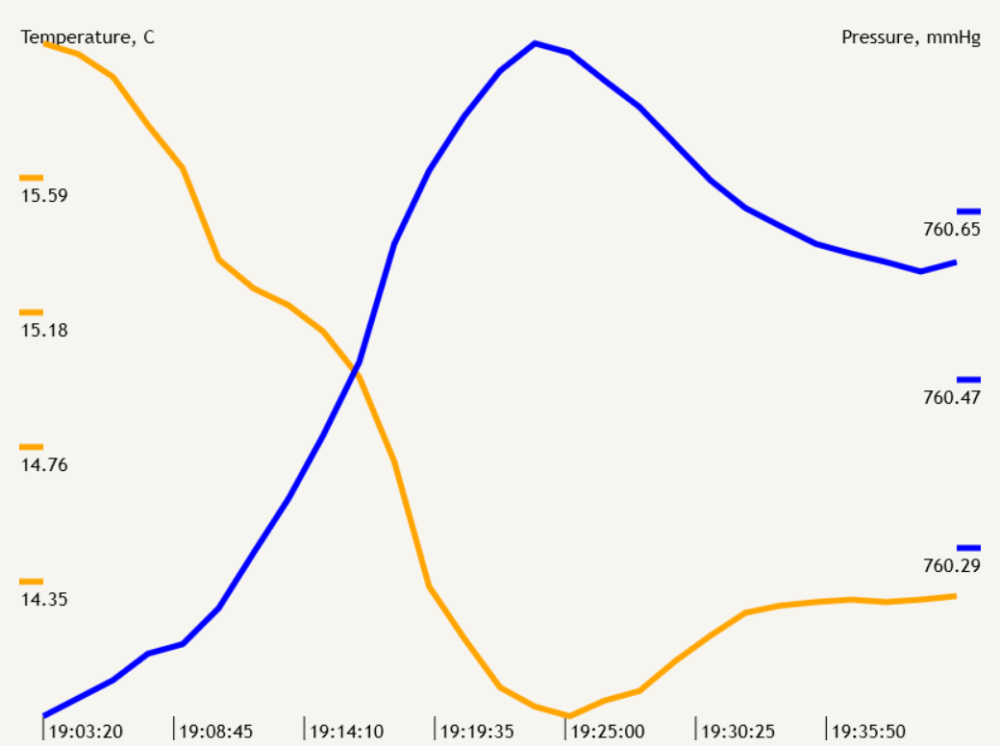

# CanvasChart library



## Library methods:
```C++
CanvasChart newChart(uint16_t points, bool extraData);
```
creating an object of the class 
(`points` - the number of points of reference in the stack (FIFO), `extraData` - using an additional data column (by default false)).
____
```C++
void CanvasChart.setLegendFont(String font, uint8_t size);
```
set font and size for axis labels. Optional method.
____
```C++
void CanvasChart.setXLegendPoints(uint8_t intervaleA);
```
set the number of samples on the X-axis. Optional method.
____
```C++
void CanvasChart.setYLegendPoints(uint8_t intervaleLeft, uint8_t intervaleRight); 
```
set the number of samples for the left and right Y-axes (intervaleRight optional with `extraData` = true). Optional method.
____
```C++
void CanvasChart.setLeftYstyle(String lineColor, uint8_t lineWidth, String label);
```
set the line color, width and top label for the first (left) graph. Optional method.
____
```C++
void CanvasChart.setRightYstyle(String lineColor, uint8_t lineWidth, String label);
```
set the line color, width and top label for the additional (right) graph. Optional method.
____
```C++
void CanvasChart.setTimeFormat(uint8_t TimeFormat);
```
set the time formatting type for epoch time
(preset `YY` - year, `MO` - month, `DD` - day of the month, `HH` -  hour, `MM` - minutes, `SS` - seconds, `MS` - milliseconds, e.g. "HH:MM:SS.MS". 
You can use any separators). Optional method.
____
```C++
bool CanvasChart.ready();
```
return true if the chart can be displayed (3 or more points).
____
```C++
void CanvasChart.push(uint64_t X, float A, float B);
```
add a row of data to the stack (`X` - X column of data (e.g. epoch time), `A` - Y-letf column of data, `B` - Y-right column of data (optional with `extraData` = true).
____
```C++
string CanvasChart.getChart(uint16_t width, uint16_t height);
```
return a string with the script text for drawing a chart with dimensions width / height.
____